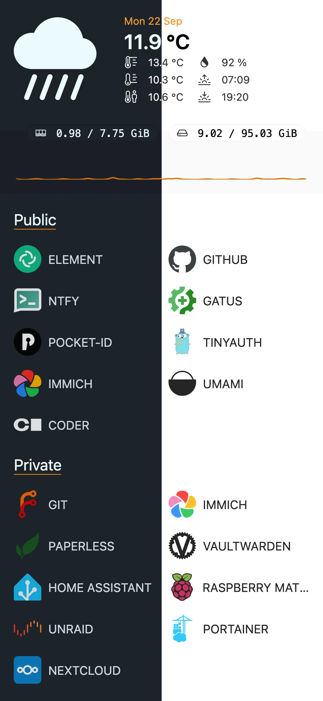
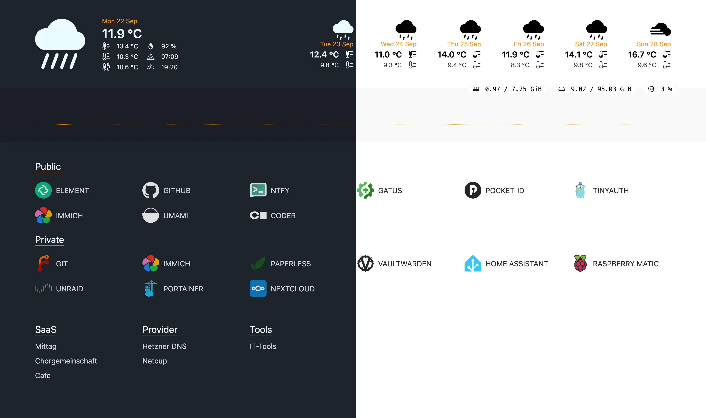

# GoDash

goDash is a simple, customizable dashboard written in Go. It provides an overview of weather information, system status, and bookmarks with icons and links.

# Table of Contents

- [GoDash](#godash)
- [Table of Contents](#table-of-contents)
  - [Features](#features)
  - [Screenshots](#screenshots)
    - [Mobile](#mobile)
    - [Desktop](#desktop)
  - [Config](#config)
  - [Docker](#docker)
    - [run command](#run-command)
    - [compose file](#compose-file)
  - [✨ Star History](#-star-history)
  - [License](#license)
  - [Contributing](#contributing)

## Features

- Displays current weather
- Displays weather forcast for up to 6 days
- Shows system status and resource usage
- Provides quick access to bookmarks with icons and links
- Lightweight and easy to deploy with Docker

## Screenshots

<div align="left">

### Mobile



### Desktop


</div>

## Config

At startup, godash will look for a `config.yaml` file in the current directory or create one. If it exists, it will be used to override the default values.

Icons can be stored in a folder called icons or godash will automatically download from [https://selfh.st/icons/](https://selfh.st/icons/) with the prefix `sh/`

```yaml
log_level: "info"  # Valid options: debug, info, warn, error
time_zone: "Europe/Berlin"  # Must be a valid IANA timezone (e.g., America/New_York, Europe/London)
title: "My Dashboard"  # Any string

server:
  address: "0.0.0.0"  # Valid IPv4 address, defaults to 0.0.0.0
  port: 8156  # Optional, must be between 1024 and 65535, defaults to 8156

weather:
  units: "celsius"  # Valid options: celsius, fahrenheit
  latitude: 52.5163  # Optional, must be a valid latitude (-90 to 90)
  longitude: 13.3776  # Optional, must be a valid longitude (-180 to 180)

applications:
  - category: "Productivity"  # Any string
    entries:
      - name: "Notion"  # Any string
        icon: "notion.png"  # File name or path for icon
        ignore_dark: false  # should not use the light icon even though it exists in dark mode
        url: "https://www.notion.so"  # Optional, must be a valid URL
      - name: "Slack"
        icon: "sh/slack.svg" # Use self-hosted icons
        ignore_dark: true
        url: "https://slack.com"

  - category: "Entertainment"
    entries:
      - name: "YouTube"
        icon: "youtube.png"
        ignore_dark: false
        url: "https://www.youtube.com"
      - name: "Spotify"
        icon: "spotify.png"
        ignore_dark: false
        url: "https://www.spotify.com"

links:
  - category: "Work"
    entries:
      - name: "GitHub"
        url: "https://github.com"
      - name: "Jira"
        url: "https://jira.com"

  - category: "Social"
    entries:
      - name: "Twitter"
        url: "https://twitter.com"
      - name: "LinkedIn"
        url: "https://linkedin.com"
```

## Docker

### run command

```sh
docker run -d \
  --name godash \
  --restart always \
  -v ./config:/app/config \
  ghcr.io/flohoss/godash:latest
```

### compose file

```yaml
services:
  godash:
    restart: always
    image: ghcr.io/flohoss/godash:latest
    container_name: godash
    volumes:
      - ./config:/app/config
```

## ✨ Star History

<picture>
  <source media="(prefers-color-scheme: dark)" srcset="https://api.star-history.com/svg?repos=flohoss/godash&type=Date&theme=dark" />
  <source media="(prefers-color-scheme: light)" srcset="https://api.star-history.com/svg?repos=flohoss/godash&type=Date" />
  
</picture>

## License

This project is licensed under the MIT License - see the [LICENSE](https://github.com/flohoss/godash/blob/main/LICENSE) file for details.

## Contributing

Feel free to open issues or submit pull requests to improve goDash!
